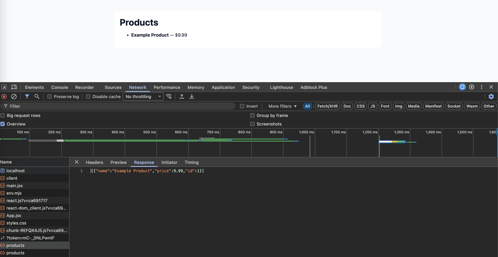

# SpringReactEcommerce


Minimal demo: Spring Boot backend + Vite React frontend (Docker Compose).

## Tech
- Backend: Java 17, Spring Boot 3.2 (Maven)
- Frontend: React 18 + Vite, Node 18
- Dev: Docker / Docker Compose (works with Colima on macOS)

## Quick Start (Docker Compose)
```bash
cd ~/Documents/Learning/SpringReactEcommerce
# Build and start services
docker compose up --build
# (or in background)
docker compose up -d --build
# Follow logs
docker compose logs -f backend frontend
```

Frontend: http://localhost:5173
Backend API: http://localhost:8080/api/products

## Development (run services separately)
- Backend (local Maven):
```bash
cd backend
mvn spring-boot:run
```
- Frontend (local Vite):
```bash
cd frontend
npm install
npm run dev -- --host 0.0.0.0
```

## API
GET `/api/products` — returns JSON product list. Example:
```json
[{"id":1,"name":"Example Product","price":9.99}]
```

## CI
A basic GitHub Actions workflow (`.github/workflows/ci.yml`) is included that builds the backend and frontend on push/PR.

## Next improvements
- Add unit/integration tests
- Add screenshots or demo link
- Add more endpoints and frontend pages

## License
This project is licensed under the [MIT License](LICENSE).

## Screenshot
Add a screenshot to `screenshots/image.png` and it will display here:


